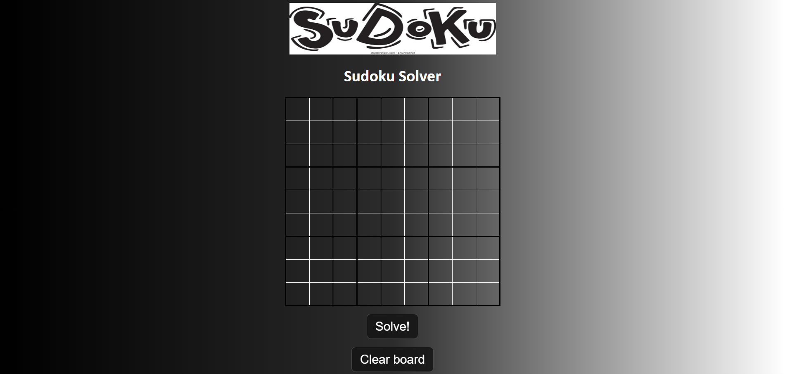
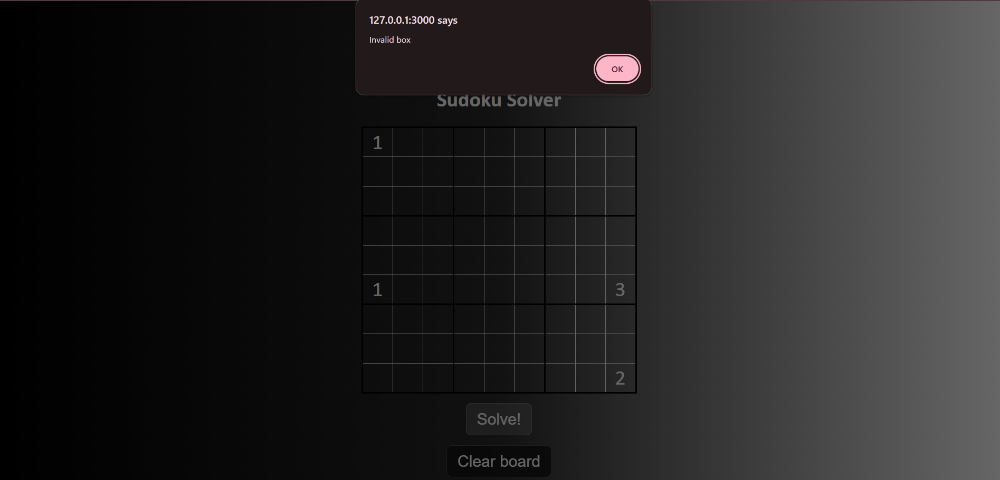
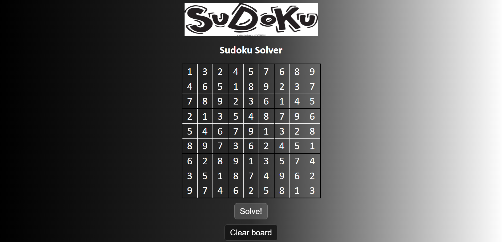

# Sudoku Solver

A web-based Sudoku Solver built using HTML, CSS, and JavaScript.

## Features

- Solve Sudoku instantly
- Backtracking algorithm
- Responsive UI
- Voice alerts for invalid and solved states
- Interactive Sudoku board

## Tech Stack

- HTML
- CSS
- JavaScript

## Screenshots
Home Page----------------------------------------------------

Error---------------------------------------------------------

Solved page----------------------------------------------------

## How to Run

1. Download the project
2. Open index.html in browser

## Author

Aradhya Dwivedi
